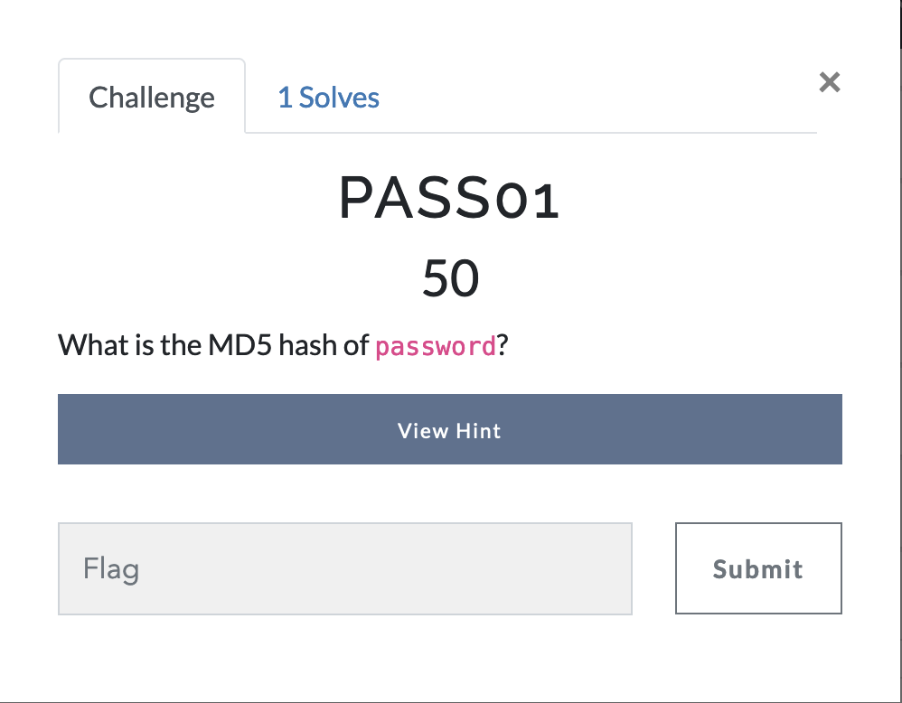
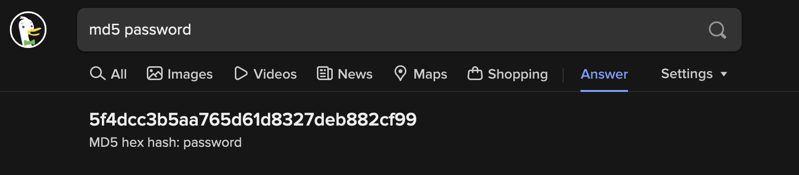

# Password Cracking - Challenge 1

As you can see, this challenge is pretty simple; it asks you to find the MD5 hash of the word `password` .

There are several online websites or command-line utilities you can use to generate the MD5 hash of a given word piece of data. As an **avid duckduckgo user**, however, it was as simple as looking up `md5 password` in duckduckgo, and I was immediately met with the answer, as seen below. 

# Answer
5f4dcc3b5aa765d61d8327deb882cf99