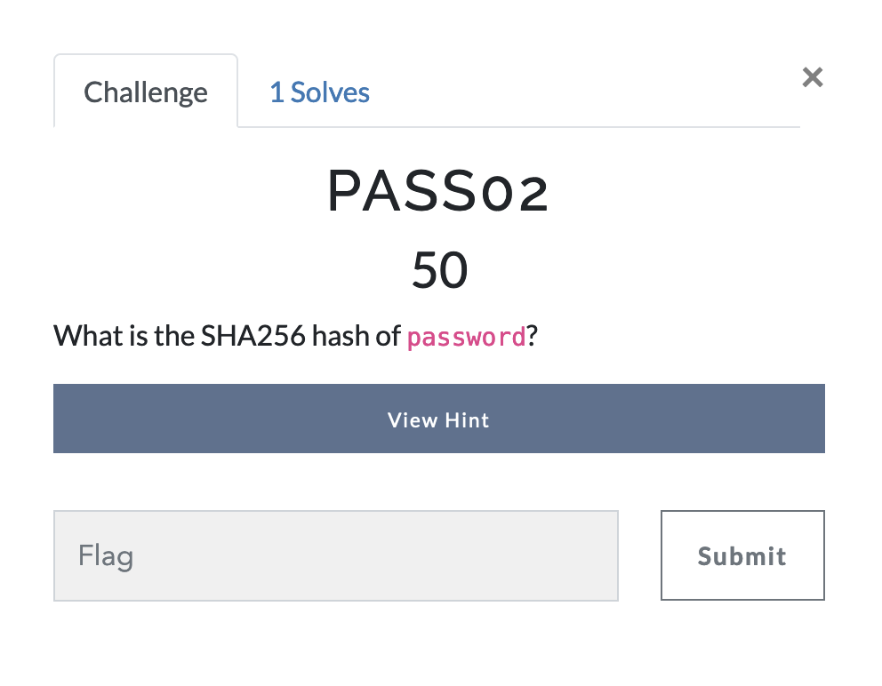
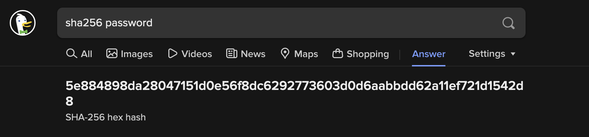

# Password Cracking - Challenge 2

This challenge is much like the previous challenge, but rather than using md5, we're told to use sha256. 
So once again, we set out to find the hash of `password` .

As stated previously, you can use a variety of online tools or other hashing utilities. But, for speed, security, and bragging rights, ***[duckduckgo](https://duckduckgo.com)*** is my tool of choice.

So, in duckduckgo we simply lookup `sha256 password`, and we are met with the hash, as seen below.

# Answer
5e884898da28047151d0e56f8dc6292773603d0d6aabbdd62a11ef721d1542d8
