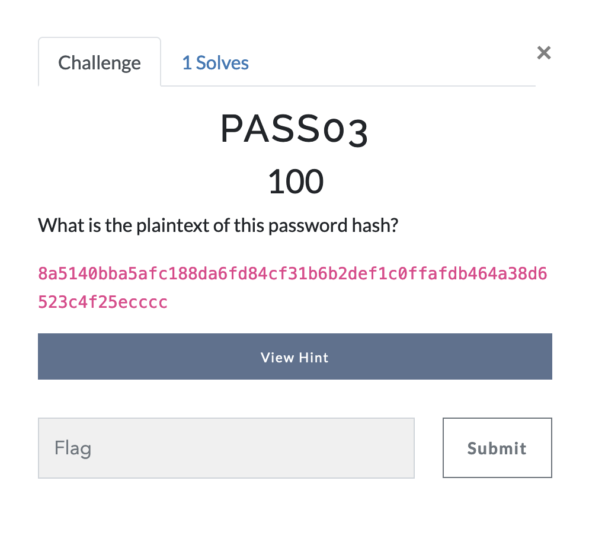
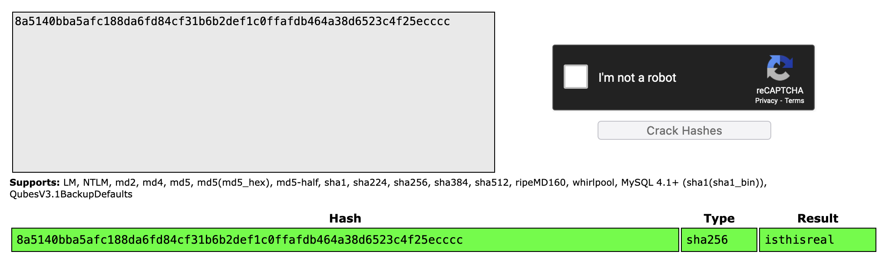

# Password Cracking - Challenge 3 

Here's where things get a little more tricky. In the first two challenges, all we really needed to do is find the right tool to perform a hash on the given password. In this one, however, we've gotta go the other way; we're given the hash, and we need to find the password. 

The remainder of the challenges in this category will be similar to this one, in that we will be given the hashes of passwords, and we are meant to find the password itself. Learning techniques to solve problems such as these is important, as most passwords you'll encounter in your hacking career will likely be hashed or in some encoded format, rather than in simple plaintext. 

There are tons of tools to approach a problem such as this one; we can try to use hashcat and a large wordlist such as rockyou.txt (A great resource for wordlists can be found in [this github repo](https://github.com/danielmiessler/SecLists)), or we can use OphCrack, or we can try our hands at using online tools. 

You'll often have to try several tools before you can find the right one for the given problem. Luckily for me, I went with the online route at first, and it ended up working! 
I used a website called [crackstation.net](https://crackstation.net), an online rainbow tables tool that is very quick and simple to use. You simple copy and paste the hash (or list of hashes) that you'd like to decode, and it checks its massive database of cracked hashes for you!

# Answer
isthisreal
