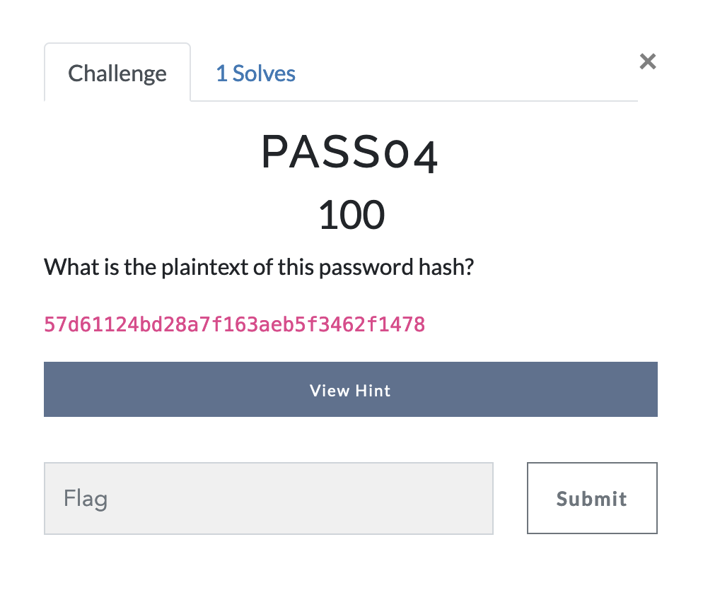
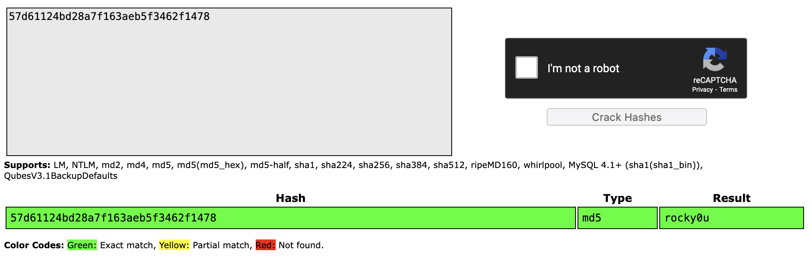

# Password Cracking - Challenge 4

I took the same approach to solving this challenge as I did [the previous one](pass03.md). 
Once again, I ended up lucky, as [crackstation](https://crackstation.net) had the right password for me on my first go. 

It's important to note how this approach works. Normally, the process for trying to find a password from a hash is as follows:
1) Identify the hashing algorithm used
2) Try to narrow down the specifications of the password (try to figure out how long the password might be, if it's likely to use uppercase and lowercase, if it may use special characters, etc.)
3) Hash potential passwords and see if they match the given hash. If they do, then you found the right password!

Crackstation, as well as OphCrack, use a slightly different approach known as [Rainbow Tables](https://en.wikipedia.org/wiki/Rainbow_table). You can read more about them on the wikipedia, but put simply, these are massive collections of pre-computed hashes, and their attributed passwords. When you enter in your hash, a dictionary-like search is performed to see if the hash exists in the precomputed tables, and if it does, then the password is found. 

# Answer
rocky0u