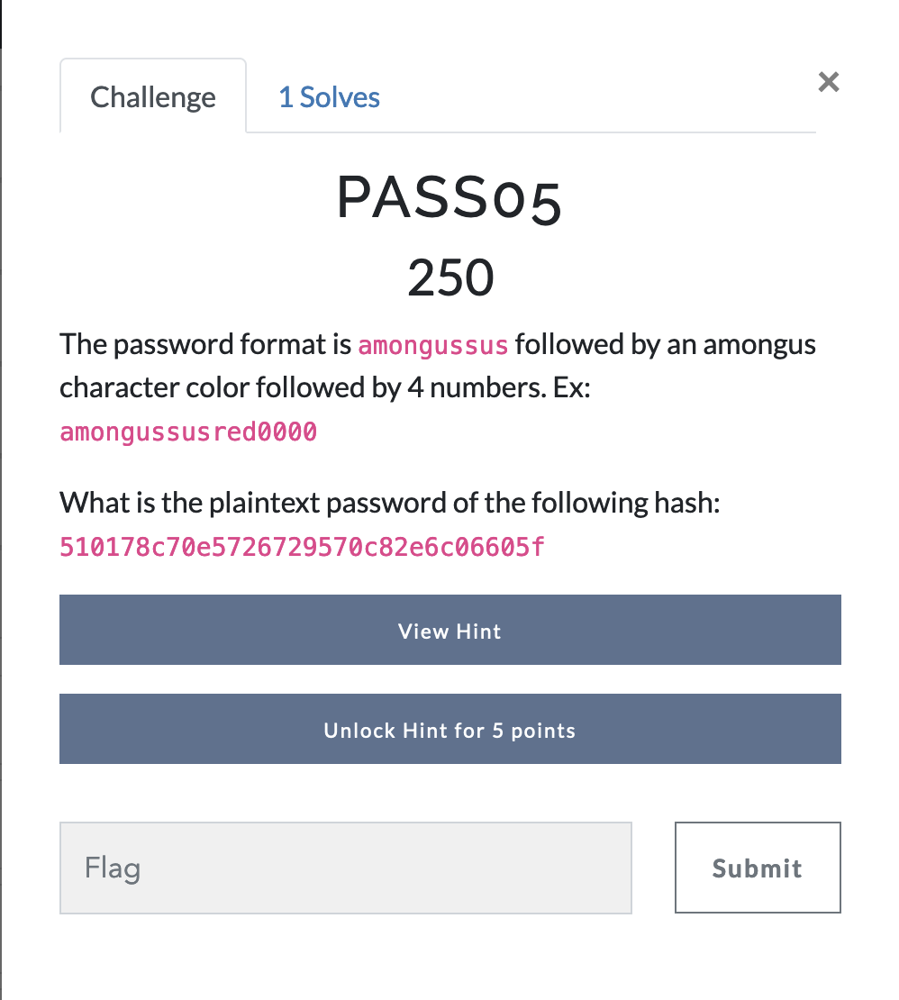

# Password Cracking - Challenge 5



*Writeup Note: I find the password format of this challenge to be personally offensive*

Personal distaste aside, these last two problems represent a classic task in password cracking; we are given a set of constraints for potential passwords, as well as the hash of the password itself. 

Given the unique password format, it is unlikely that rainbow tables or common wordlists such as `rockyou.txt` will work in this context. So, we have to generate our own wordlist. 

I did this with a quick python script. There might be more efficient methods to do this, especially with Excel, but for my purposes, a Python script was quick and easy. In a timed competition, it's better not to stress over which tool can do something in an absolutely optimal manner, when you can use a tool you already are familiar with that'll get the job done. 

It's important to note the password format before we get to coding; we know that the base of each password is `amongussus`, followed by a color, and then 4 numbers. What's important to note, and is seen from the example, is that the 4 numbers range from 0000 to 9999. In coding terms, though, we have to be careful; simply counting up from 1 to 10,000 won't cut it, as the numbers from 1-1000 need to have leading zeros to make them four digits! a password such as amongussusred1 doesn't actually meet our requirements! 

You could use a recursive algorithm to make sure that each of the numbers is exactly four digits long, with leading zeros if necessary, but for the purposes of making a relatively short wordlist, I just made a simple program that uses python's string manipulation to get the job done. 

As for the colors, I just looked up 'among us colors' and found the list from the wiki. 

```python
base = "amongussus"
colors = ["red", "blue", "green", "pink", "orange", "yellow", "black", "white", "purple", "brown", "cyan", "lime", "maroon", "rose", "banana", "gray", "tan", "coral"]

for color in colors:
	words = []
	for i in range(10000):
		num = str(i)
		num = ("0" * (4 - len(num))) + num
		words.append(base + color + num + '\n')
	with open('words.txt', 'a') as f:
		f.writelines(words)
```

As we can see in the script, we set up a base word as well as a list of colors. For each color, we loop through all the four digit number combinations, and add the base, the color, and the four digit numbers all to a file. 

From a purely technical standpoint, there are many ways this program could be improved. You could make it recursive, you could rearrange it to generate all numbers once, rather than for each color, etc. The point is, however, that I typed up this script in less than two minutes, and it required zero debugging. I could have spent more time making a quicker, more robust script, but I knew that I would only need to run it once, and I was on a timer, so I just did it as quickly as I could. 

Once you run the program, you get a massive wordlist, which you can then use in hashcat!

```bash 
$ hashcat -m 0 -a 0 510178c70e5726729570c82e6c06605f ~/words.txt
```

With this command, we start a simple dictionary attack with the given hash, and the now generated wordlist (given that the wordlist is placed in the home directory), and we're met with our answer! 

# Answer
amongussusyellow1337
