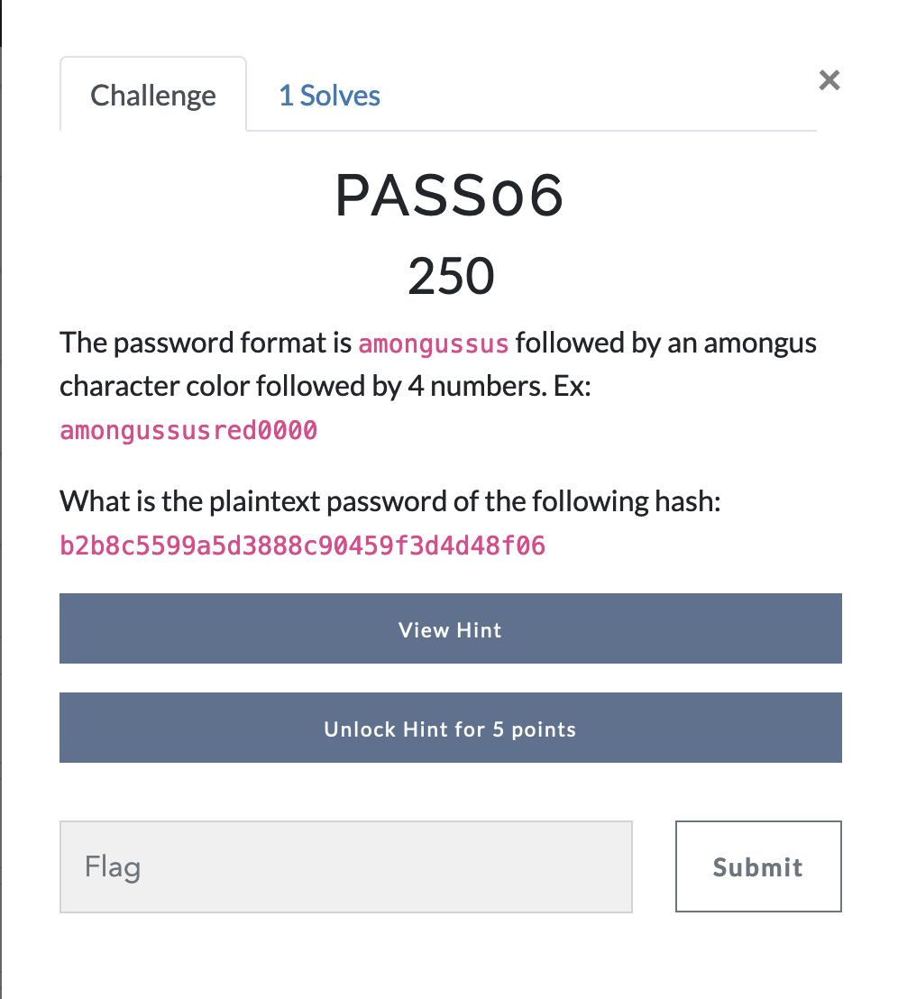

# Password Cracking - Challenge 6 (FINAL)



This final challenge uses the exact same approach, philosophy, and wordlist as the previous challenge, whose writeup can be found [here](pass05.md).

For more detailed explanations, check the writeup for the previous challenge, but for simplicity, I'll copy-paste the script I used to generate the wordlist.

```python
base = "amongussus"
colors = ["red", "blue", "green", "pink", "orange", "yellow", "black", "white", "purple", "brown", "cyan", "lime", "maroon", "rose", "banana", "gray", "tan", "coral"]

for color in colors:
	words = []
	for i in range(10000):
		num = str(i)
		num = ("0" * (4 - len(num))) + num
		words.append(base + color + num + '\n')
	with open('words.txt', 'a') as f:
		f.writelines(words)
```

Once again, we use our wordlist on the supplied hash with hashcat, and we should get our answer!
```bash
$ hashcat -m 0 -a 0 b2b8c5599a5d3888c90459f3d4d48f06 ~/words.txt
```

# Answer 
amongussuspurple2222